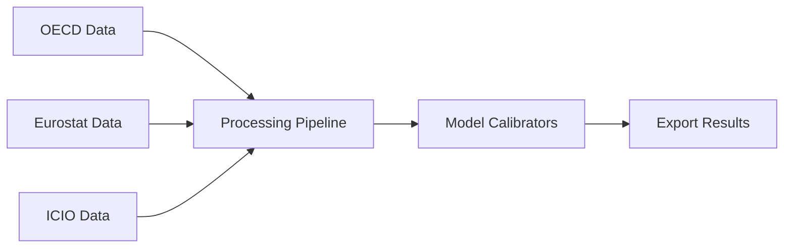

# Macro ABM Calibration

A Python package for calibrating macroeconomic agent-based models from OECD data sources.

## Overview

This project converts MATLAB-based calibration workflows into a modern, well-documented Python package. It provides:

- **Data Sources**: Connectors for OECD, Eurostat, and ICIO databases
- **Processing Pipeline**: Currency conversion, industry aggregation, and harmonization
- **Model Calibrators**: ABM parameter estimation and initial conditions setup
- **Export System**: Results in multiple formats (MATLAB, JSON, Excel, CSV)

## Key Features

- ✅ **Complete Data Infrastructure** - OECD/Eurostat/ICIO connectors with caching
- ✅ **Processing Pipeline** - Full MATLAB workflow replication 
- ✅ **Model Calibration** - ABM parameters and initial conditions
- ✅ **Flexible Configuration** - Pydantic-based with environment support
- ✅ **Comprehensive Testing** - Unit and integration test coverage
- ✅ **Type Safety** - Full type hints with mypy validation

## Quick Start

```python
from macro_abm_calibration import CalibrationConfig, DataSourceManager

# Load configuration
config = CalibrationConfig()

# Initialize data sources
manager = DataSourceManager(config)

# Run calibration workflow
# ... see Getting Started guide for complete example
```

## Project Status

**Phase 4 Complete** - Production ready system with full calibration pipeline implemented.

## Architecture



## Next Steps

- [Installation Guide](getting-started/installation.md)
- [Quick Start Tutorial](getting-started/quickstart.md)
- [API Reference](reference/)