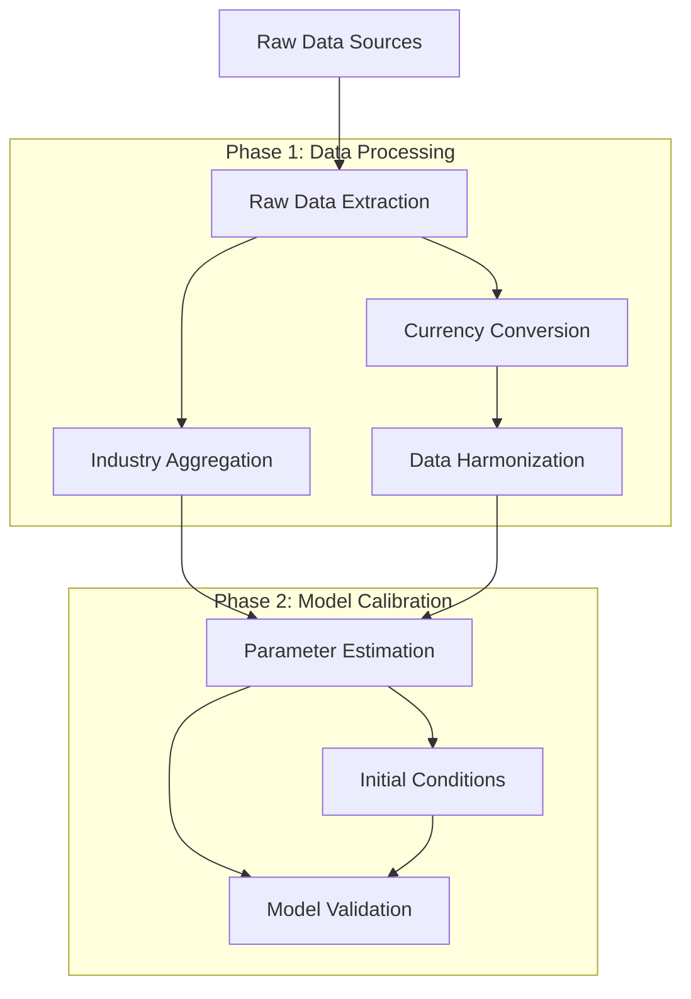

# Workflow Overview

This document provides a comprehensive overview of the macroeconomic ABM calibration workflow, including pipeline dependencies, execution order, and data flow architecture.

## System Architecture

The calibration system consists of **6 main processing pipelines** organized into **2 sequential phases**. The workflow follows a critical path that ensures data quality and consistency while replicating the original MATLAB calibration methodology.



## Pipeline Overview

### Phase 1: Data Processing Pipelines

#### 1. Raw Data Extraction Pipeline
- **Function**: Replicates `a_data.m` from original MATLAB code
- **Dependencies**: None (entry point)
- **Location**: `CalibrationPipeline._step_1_extract_raw_data()`

**Inputs**:
- Configuration parameters and file paths
- OECD SQLite database
- Eurostat exchange rate tables
- ICIO input-output matrices (.mat files)

**Processing**:
- Extract GDP data (quarterly/annual, nominal/real)
- Retrieve consumption data (household/government)
- Collect investment, trade, unemployment data
- Fetch interest rates and exchange rates
- Load ICIO input-output tables

**Outputs**:
- Raw economic datasets per country
- Exchange rate time series
- Input-output matrices
- Metadata for validation

#### 2. Currency Conversion Pipeline
- **Function**: Convert all monetary values to common currency (USD)
- **Dependencies**: Raw Data Extraction Pipeline
- **Location**: `CurrencyConverter`

**Inputs**:
- Raw economic data with mixed currencies
- Eurostat EUR-based exchange rate tables
- Country-to-currency mappings

**Processing**:
- Complex EUR→USD conversion: `LC_to_USD = LC_to_EUR / USD_to_EUR`
- Special handling for limited data currencies (ILS, KRW, MXN)
- Interpolation and extrapolation for missing values
- Eurozone direct calculation optimization

**Outputs**:
- All economic data converted to USD
- Exchange rate metadata and quality flags

#### 3. Data Harmonization Pipeline
- **Function**: Ensure time series consistency and quality
- **Dependencies**: Currency Conversion Pipeline
- **Location**: `DataHarmonizer`

**Inputs**:
- USD-converted economic time series
- Mixed quarterly and annual data frequencies

**Processing**:
- Missing data interpolation (linear, nearest neighbor)
- Deflator calculation (nominal/real variable pairs)
- Country-specific adjustments:
  - Mexico: Price base changes (L→Q)
  - USA: Government consumption reconstruction
- Quarterly/annual data alignment

**Outputs**:
- Harmonized, consistent time series data
- Calculated deflators and adjustment flags

#### 4. Industry Aggregation Pipeline
- **Function**: Aggregate industry classifications and process input-output data
- **Dependencies**: Raw Data Extraction + Data Harmonization
- **Location**: `IndustryAggregator` + ICIO processing

**Inputs**:
- ICIO matrices with 44 ISIC Rev4 industries
- Country-specific economic data
- Industry mapping configurations

**Processing**:
- Aggregate 44 ISIC Rev4 → 18 NACE2 sectors
- Multiple aggregation cases:
  - 44 × years vectors
  - 44 × 44 × years matrices  
  - 44 × countries × years arrays
- Matrix shrinking and ROW aggregation

**Outputs**:
- NACE2-aggregated input-output tables
- Industry-specific economic indicators
- Sector mapping documentation

### Phase 2: Model Calibration Pipelines

#### 5. Parameter Estimation Pipeline
- **Function**: Estimate behavioral parameters for ABM agents
- **Dependencies**: All Phase 1 pipelines
- **Location**: `ABMParameterEstimator`

**Inputs**:
- Processed and harmonized economic data
- Industry-aggregated datasets
- Country-specific macroeconomic indicators

**Processing**:
- **Taylor Rule Estimation**: Central bank response parameters
  - Inflation response coefficient (typically > 1.0)
  - Output gap response
  - Interest rate smoothing
- **Firm Behavioral Parameters**:
  - Price adjustment speed
  - Investment sensitivity to demand
  - Markup elasticity
- **Household Parameters**:
  - Marginal propensity to consume
  - Wealth effect magnitude
  - Labor supply elasticity

**Outputs**:
- Estimated ABM parameters with confidence intervals
- Goodness-of-fit statistics
- Economic theory compliance validation

#### 6. Initial Conditions Setup Pipeline
- **Function**: Initialize agent populations and market conditions
- **Dependencies**: All Phase 1 + Parameter Estimation
- **Location**: `InitialConditionsSetter`

**Inputs**:
- Processed economic data
- Estimated behavioral parameters
- Country-specific scaling factors

**Processing**:
- **Agent Population Setup**:
  - Household agents (typically 10,000+ per country)
  - Firm agents (typically 1,000+ per country)
  - Government and financial sector agents
- **Balance Sheet Initialization**:
  - Wealth distributions using Pareto distributions
  - Income distributions across households
  - Firm size and asset distributions
- **Market Conditions**:
  - Initial price levels and wage levels
  - Interest rates and unemployment rates
  - Industry-specific conditions

**Outputs**:
- Agent populations by type and country
- Initial balance sheets and wealth distributions
- Market condition parameters
- Industry-specific agent characteristics

#### 7. Model Validation Pipeline (Optional)
- **Function**: Quality assurance and compliance verification
- **Dependencies**: Parameter Estimation + Initial Conditions
- **Location**: `ModelValidator`

**Inputs**:
- Estimated parameters
- Initial conditions
- Historical benchmarks

**Processing**:
- Economic theory compliance checks
- Cross-validation against MATLAB outputs
- Parameter bounds validation
- Agent population consistency checks
- Balance sheet aggregation validation

**Outputs**:
- Validation reports and quality scores
- Compliance flags and warnings
- Comparison metrics with benchmarks

## Critical Path Analysis

### Sequential Dependencies

The workflow follows a **strict sequential critical path** where each phase depends on the completion of previous phases:

```
Raw Data → Currency Conversion → Data Harmonization → Parameter Estimation → Initial Conditions
```

### Dependency Details

| Pipeline | Depends On | Critical | Parallel Opportunity |
|----------|------------|----------|---------------------|
| Raw Data Extraction | None | Yes | None |
| Currency Conversion | Raw Data | Yes | None |
| Data Harmonization | Currency Conversion | Yes | None |
| Industry Aggregation | Raw Data + Harmonization | Yes | Partial (ICIO processing) |
| Parameter Estimation | All Phase 1 | Yes | Country-level |
| Initial Conditions | All previous | Yes | Country-level |
| Model Validation | Parameters + Conditions | No | Independent |

### Parallelization Opportunities

**Within-Phase Parallelization**:
- **Country-level processing**: Each country can be processed independently within most pipelines
- **Data source loading**: OECD, Eurostat, and ICIO data can be loaded concurrently
- **Industry aggregation**: Can process multiple industry matrices in parallel

**Cross-Phase Parallelization**:
- **ICIO processing**: Can begin after Raw Data Extraction, parallel to currency conversion
- **Model validation**: Can run independently after parameter estimation completes

## Execution Flow

### Main Orchestrator

The `CalibrationPipeline` class orchestrates the entire workflow:

```python
# Complete workflow execution
pipeline = CalibrationPipeline(config)

# Phase 1: Data Processing
raw_data = pipeline._step_1_extract_raw_data()
processed_data = pipeline._step_2_process_calibration_data(raw_data)
icio_data = pipeline._step_3_process_icio_data()
final_data = pipeline._step_4_create_final_datasets(processed_data, icio_data)

# Phase 2: Model Calibration
calibrator = ABMParameterEstimator(config)
parameters = calibrator.estimate_parameters(final_data)

conditions_setter = InitialConditionsSetter(config)
initial_conditions = conditions_setter.setup_conditions(final_data, parameters)

# Optional validation
validator = ModelValidator(config)
validation_results = validator.validate(parameters, initial_conditions)
```

### Error Handling and Recovery

**Failure Points**:
- **Phase 1 failures**: Stop execution, cannot proceed to calibration
- **Parameter estimation failure**: Cannot initialize model
- **Initial conditions failure**: Cannot run simulation
- **Validation failure**: Only affects quality assurance

**Recovery Mechanisms**:
- **Graceful degradation**: Continue with available data when possible
- **Partial processing**: Process available countries even if some fail
- **Checkpoint system**: Save intermediate results for recovery
- **Validation bypass**: Skip validation if optional

## MATLAB Heritage

### Original Workflow Mapping

The Python workflow directly replicates the original MATLAB sequence:

| MATLAB Script | Python Pipeline | Function |
|---------------|-----------------|----------|
| `a_data.m` | Raw Data Extraction | Extract economic data |
| `b_calibration_data.m` | Currency + Harmonization | Process and convert data |
| `c1_icios_data.m` | Industry Aggregation | Process input-output tables |
| Parameter estimation scripts | ABM Parameter Estimator | Estimate behavioral parameters |
| Initialization scripts | Initial Conditions Setter | Setup model starting conditions |

### Consistency Validation

The system includes validation against MATLAB outputs to ensure:
- **Numerical consistency**: Same parameter estimates within tolerance
- **Data structure compatibility**: Compatible .mat file formats
- **Economic validity**: Same economic relationships preserved

## Performance Characteristics

### Computational Complexity

**Phase 1 (Data Processing)**:
- **I/O Bound**: Database queries and file loading
- **Memory Intensive**: Large matrices and time series
- **CPU Moderate**: Mainly data transformations

**Phase 2 (Model Calibration)**:
- **CPU Intensive**: Statistical estimation and optimization
- **Memory Moderate**: Parameter storage and validation
- **I/O Light**: Mainly result output

### Scalability Considerations

**Country Scaling**:
- Linear scaling with number of countries
- Independent country processing enables parallelization
- Memory usage scales with country count

**Time Period Scaling**:
- Linear scaling with time series length
- Processing time increases with longer time series
- Memory usage scales with data frequency (quarterly vs annual)

**Industry Scaling**:
- Quadratic scaling with industry count (matrix operations)
- ICIO processing most affected by industry aggregation
- Current system optimized for 44→18 industry mapping

## Configuration and Customization

### Workflow Configuration

```yaml
workflow:
  parallel_countries: true
  checkpoint_enabled: true
  validation_required: false
  
phases:
  data_processing:
    currency_conversion: required
    industry_aggregation: required
    harmonization: required
  
  calibration:
    parameter_estimation: required
    initial_conditions: required
    validation: optional
```

### Custom Pipeline Insertion

The system supports custom pipeline insertion:

```python
# Add custom processor
class CustomProcessor(DataProcessor):
    def process(self, data):
        # Custom processing logic
        return processed_data

# Insert into workflow
pipeline.add_processor(CustomProcessor(), after="currency_conversion")
```

## Monitoring and Diagnostics

### Progress Tracking

The workflow provides detailed progress tracking:

```python
# Progress callback
def progress_callback(stage, country, progress):
    print(f"{stage}: {country} - {progress:.1%} complete")

pipeline.run(countries=["USA", "DEU"], progress_callback=progress_callback)
```

### Performance Metrics

**Execution Timing**:
- Phase-level timing breakdown
- Country-level processing time
- Pipeline-specific performance metrics

**Resource Usage**:
- Memory consumption tracking
- CPU utilization monitoring
- I/O operation counting

### Error Reporting

**Detailed Error Context**:
- Pipeline stage where error occurred
- Country and data subset affected
- Suggested recovery actions

## Best Practices

### Workflow Execution

1. **Validate Configuration**: Ensure all data paths and parameters are correct
2. **Check Data Availability**: Verify required input files exist
3. **Monitor Progress**: Use progress callbacks for long-running processes
4. **Save Checkpoints**: Enable checkpointing for large country sets
5. **Validate Results**: Always run validation pipeline

### Performance Optimization

1. **Parallel Execution**: Enable country-level parallelization
2. **Memory Management**: Process countries in batches for large datasets
3. **Caching**: Use data source caching for repeated runs
4. **Profiling**: Monitor performance bottlenecks

### Quality Assurance

1. **Cross-Validation**: Compare results with MATLAB outputs
2. **Economic Validation**: Verify parameter economic reasonableness
3. **Data Quality Checks**: Monitor data completeness and consistency
4. **Version Control**: Track configuration and data versions

## Related Documentation

- [Data Sources](data-sources.md) - Input data requirements and connectors
- [Processing Pipeline](processing.md) - Detailed processor documentation
- [Country-Specific Processing](country-specific-processing.md) - Special handling requirements
- [Model Calibration](calibration.md) - Parameter estimation details
- [Calibration Outputs](outputs.md) - Output formats and structures
- [Configuration](../getting-started/configuration.md) - System configuration options